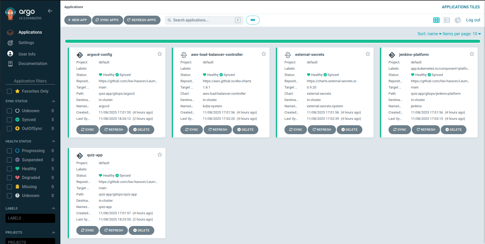

# GitOps Repository - ArgoCD Configuration

This directory contains all Kubernetes manifests managed by ArgoCD using the **App-of-Apps** pattern. ArgoCD continuously syncs these configurations from Git to the EKS cluster, ensuring the desired state is always maintained.

## Directory Structure

```
gitops/
├── bootstrap/
│   └── root-app.yaml              # Root App-of-Apps (entry point)
├── applications/                  # ArgoCD Application manifests (pointers)
│   ├── prerequisites.yaml         # One-time resources (sync wave -2)
│   ├── external-secrets.yaml      # External Secrets Operator (sync wave -1)
│   ├── aws-load-balancer-controller.yaml  # ALB Controller (sync wave -1)
│   ├── mongodb.yaml               # MongoDB database (sync wave 0)
│   ├── jenkins-platform.yaml      # Jenkins CI/CD (sync wave 0)
│   ├── quiz-backend.yaml          # Backend API (sync wave 1)
│   └── quiz-frontend.yaml         # Frontend React app (sync wave 2)
├── prerequisites/                 # One-time Kubernetes resources
│   ├── argocd-targetgroupbinding.yaml  # ArgoCD ALB access
│   └── mongodb-ebs-volume.yaml    # MongoDB PV for existing EBS volume
├── jenkins-platform/              # Jenkins Helm chart
├── quiz-backend/                  # Backend Helm chart
└── quiz-frontend/                 # Frontend Helm chart
```


## Deployment Process

The infrastructure deployment order is critical to not have dependency issues. 
the order of deployment is:

```
1. Terraform provisions EKS cluster + AWS resources
   ├── VPC, subnets, security groups
   ├── EKS cluster with node groups
   ├── ALB target groups
   ├── IAM roles (IRSA for ALB controller, External Secrets)
   └── Outputs: ARNs, IPs, DNS names

2. Terraform outputs are injected into GitOps manifests
   ├── values.yaml files updated with Terraform outputs
   ├── TargetGroupBinding ARNs
   ├── Security group IDs
   └── Changes pushed to GitHub

3. Root App-of-Apps is deployed to ArgoCD
   └── kubectl apply -f bootstrap/root-app.yaml

4. ArgoCD syncs all applications in order (sync waves)
   ├── Wave -2: Prerequisites (ArgoCD TGB, MongoDB PV/PVC)
   ├── Wave -1: Infrastructure (External Secrets, ALB Controller)
   ├── Wave 0:  Platform Services (MongoDB, Jenkins)
   ├── Wave 1:  Backend API (Quiz Backend)
   └── Wave 2:  Frontend (Quiz Frontend)
```

##  Architecture 

### Argocd Applications view


### Why App-of-Apps Pattern?

**Advantages:**
- Single entry point (`root-app.yaml`)
- Centralized dependency management via sync waves
- Easier to bootstrap new environments
- Git as single source of truth

**Compared to:**
- **Individual Applications:** Manual creation, no dependency ordering
- **ApplicationSets:** Better for multi-cluster/multi-tenant, overkill for single environment

### Why Helm Charts?

**Advantages:**
- Templating for environment-specific values
- Terraform outputs injected at deploy time
- Reusable across dev/staging/prod
- Standard packaging format

### Secret Management

The platform uses **External Secrets Operator** to sync secrets from AWS SSM Parameter Store.

- The goal of External Secrets Operator is to synchronize secrets from external APIs into Kubernetes. ESO is a collection of custom API resources - ExternalSecret, SecretStore and ClusterSecretStore that provide a user-friendly abstraction for the external API that stores and manages the lifecycle of the secrets for you.

### Why This Design?

- **No secrets in Git:** All credentials stored in AWS SSM
- **GitOps-friendly:** ExternalSecret manifests tracked by ArgoCD
- **IRSA authentication:** No AWS keys needed (pod identity)

## Helm Values Injection

Terraform outputs are automatically injected into Helm values by the `manage-project.sh` script.
- To read more about the scritps, **[click here](../iac/scripts/README.md)**

```bash
# Terraform outputs example
target_group_arn = "arn:aws:elasticloadbalancing:..."
alb_security_group_id = "sg-044452ce595e62972"

# Injected into gitops/quiz-backend/values.yaml
targetGroupBinding:
  targetGroupARN: "arn:aws:elasticloadbalancing:..."
  networking:
    ingress:
      - from:
          - securityGroup:
              groupID: "sg-044452ce595e62972"
```

This keeps Terraform as the source of truth for infrastructure IDs.